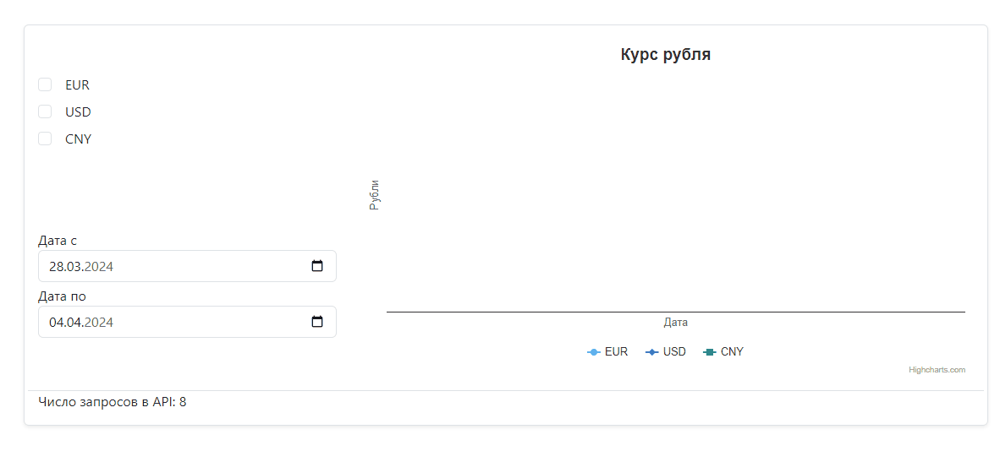

### Как запустить:  

* git clone https://github.com/korchel/exchange-rates.git
* cd exchange-rates
* npm install
* npm start
  
### Описание:
При выборе типа валюты строится график изменения ее курса за указанный промежуток времени. При этом самая ранняя дата, которую возможно указать - 1 марта 2024г., так как в API нет данных для более ранних дат. Если на какую-то дату не будут получены данные, то в графике будет разрыв.
Счетчик запросов к API не увеличивается, если ранее запрос по данной дате уже был сделан и данные сохранены в кэше состояния.
_____

[deploy](https://exchange-rates-7vm0eug5j-korchels-projects.vercel.app/)
_____

